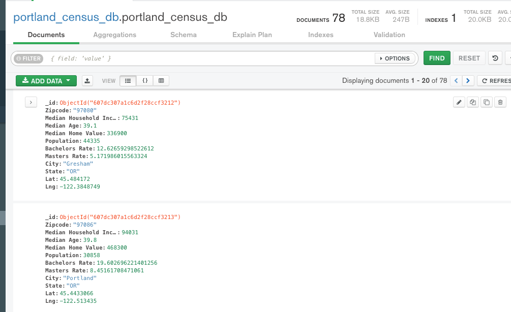

# disguised_ostriches

Table of Contents:
=======
- [Summary of Project](#summary-of-project)
- [How to replicate our code](#how-to-replicate-our-code)
- [Data Sources](#data-sources)
- [Visuals](#visuals)
- [Workflow](#workflow)
- [Conclusion](#conclusion)

Group Members:
=======
- Lauren Toothaker
- Katie Hartmann
- Charlie Loveall

Summary of Project:
==========
The goal of this project is to look at Heritage Tree sites in the Portland area
and compare it with U.S. Census Bureau data on demographics of the site near
the Heritage tree.

How to replicate our code:
=======
In your config.js add these things: const API_KEY as a variable.
In your config.py add these things: g_key, census_api_key as variables.
Run ETL_process.ipynb using requirements.txt in Python to query the api's and
store them to a local MongoDB. 

Data Sources:
=========

Portland Maps OpenData Heritage Trees:
(https://gis-pdx.opendata.arcgis.com/datasets/heritage-trees/data?geometry=-122.953%2C45.434%2C-122.306%2C45.602)

U.S. Census Bureau API

Google Geocode API:
(https://maps.googleapis.com/maps/api/geocode/json)

Visuals:
=======
- Heatmap of Heritage trees
    - Additional layers of map data
- Scatter plot of stats around Heritage sites
    - Median home value
    - Education
    - Median income
- Nice to have: neighborhood level data/area layer
- Nice to have: zip code level data/area layer

Workflow:
========
Katie will utilize prior experience with UCB data and Google Geocode to combine
Google coordinates with UCB data and upload them to a single CSV file that will
then be pushed to a MongoDB database. She will manage the API endpoint and
configure the data so we can utilize the data.

From Mongo we will utilize Flask to create a website structure.

Charlie has a heatmap about Heritage trees that can be repurposed for this site.
He will also manage the Flask framework creation.

Lauren will create visualizations and manage the front end.

Conclusion:
========
** Add notes about what we learned and what we might do differently if we had more time **

Given more time, we would like to further look into the following:
- median home values and incomes by zipcode over the same range of years included in the heritage trees dataset
- identify and execute a means of comparing locations on either neighborhoods or zip codes for a one-to-one comparison
- include additional layers to toggle between on the initial map